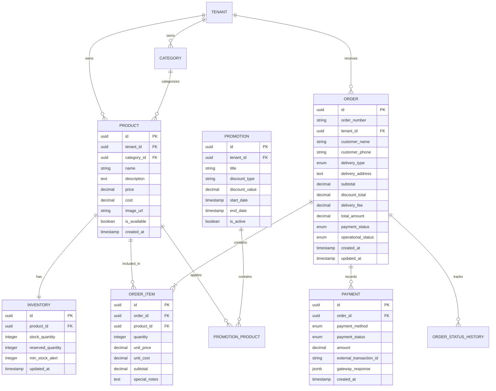

# saasPedidos 🍔🍕 - Plataforma SaaS de Pedidos de Comida en Tiempo Real

Plataforma integral y responsiva para gestión de pedidos de comida, diseñada con arquitectura de desacoplamiento de estados (financiero vs. cocina), control de inventario con alertas de stock bajo, cálculo dinámico de márgenes de ganancia y experiencia de cliente **Mobile-First**.

---

## 📱 Demostración y Ejecución del Frontend (React)

El frontend está desarrollado con **React 19**, **Vite**, **Tailwind CSS** y **Lucide Icons**, optimizado especialmente para pantallas móviles de smartphones y tablets.

### Instalación y Ejecución Local

```bash
# 1. Instalar dependencias
npm install

# 2. Ejecutar servidor de desarrollo
npm run dev

# 3. Compilar para producción
npm run build
```

### Funcionalidades del Frontend

1. **Módulo Cliente (Mobile-First):**
   - **Header de Marca y Selector de Modalidad:** Alterna entre *Delivery*, *Retiro en Mostrador* y *En Mesa/Salón*.
   - **Carrusel de Ofertas y Descuentos:** Sección destacada con temporizador visual, badges de descuento (ej. *20% OFF*, *Happy Hour*) y botón de agregado rápido.
   - **Pestañas de Categorías con Desplazamiento Táctil:** Acceso instantáneo a Burgers, Pizzas, Combos, Bebidas y Postres con conteo dinámico.
   - **Tarjetas de Producto con Control Táctil:** Precios de oferta vs regular tachado, alertas de stock bajo (*"¡Solo quedan X unidades!"*) y selector táctil `+` / `-`.
   - **Modal de Personalización:** Permite agregar notas e instrucciones especiales para la cocina (*"Sin cebolla", "Punto bien cocido"*).
   - **Bottom Sheet / Carrito Deslizable:** Validación de stock en tiempo real (impide ordenar más de las existencias disponibles), resumen de subtotales, descuentos promocionales y botón de checkout directo.
   - **Checkout Móvil:** Formulario de cliente, selección de método de pago (Tarjeta Online, Efectivo contra entrega o Transferencia/QR) y generación de orden con ID único.
   - **Pantalla de Seguimiento (Order Tracking):** Stepper visual animado con 4 etapas operativas, visualización en vivo del estado de pago independiente y estimación de tiempo.

2. **Módulo Administrador & Cocina:**
   - **Tablero Kanban de Cocina:** Vista en tiempo real por columnas operativas (*Recibido*, *En Preparación*, *Listo/En Ruta*, *Entregado*).
   - **Desacoplamiento Total de Estados:** Botones independientes para cambiar el *Estado de Pago* (`Pendiente`, `Pagado`, `Reembolso`) y el *Estado Operativo* de la cocina con un solo click.
   - **Gestión de Catálogo e Inventario (CRUD):** 
     - Cálculo en tiempo real del **Margen de Ganancia**: `Margen % = ((Precio - Costo) / Precio) * 100` y Ganancia neta en `$`.
     - Indicador visual y alertas de **Stock Bajo** cuando `stock <= minStockAlert`.
     - Ajuste rápido de inventario `+` / `-` directamente desde la tabla.
     - Módulo para programar ofertas promocionales y badges publicitarios.
   - **Simulador de Smartphone:** Botón superior para alternar en pantallas de escritorio entre vista completa y un marco realista de iPhone con notch e interfaz móvil.

---

## 📐 1. Modelo de Base de Datos Relacional

### Diagrama Entidad-Relación (Mermaid)



### Script DDL SQL (PostgreSQL)

```sql
-- 1. ENUMS
CREATE TYPE delivery_type_enum AS ENUM ('DELIVERY', 'TAKEAWAY', 'DINE_IN');
CREATE TYPE payment_status_enum AS ENUM ('PENDING', 'PAID', 'FAILED', 'REFUNDED');
CREATE TYPE operational_status_enum AS ENUM ('RECEIVED', 'PREPARING', 'READY_FOR_PICKUP_DELIVERY', 'DELIVERED', 'CANCELLED');
CREATE TYPE payment_method_enum AS ENUM ('ONLINE_CARD', 'CASH_ON_DELIVERY', 'BANK_TRANSFER_QR');

-- 2. TABLA DE PRODUCTOS
CREATE TABLE products (
    id UUID PRIMARY KEY DEFAULT gen_random_uuid(),
    tenant_id UUID NOT NULL,
    category_id UUID NOT NULL,
    name VARCHAR(150) NOT NULL,
    description TEXT,
    price NUMERIC(10, 2) NOT NULL CHECK (price >= 0),
    cost NUMERIC(10, 2) NOT NULL DEFAULT 0.00 CHECK (cost >= 0),
    image_url VARCHAR(500),
    is_available BOOLEAN NOT NULL DEFAULT true,
    created_at TIMESTAMP WITH TIME ZONE DEFAULT NOW(),
    updated_at TIMESTAMP WITH TIME ZONE DEFAULT NOW()
);

-- Vista con cálculo de margen de ganancia
CREATE OR REPLACE VIEW v_product_margins AS
SELECT 
    id,
    tenant_id,
    name,
    price,
    cost,
    (price - cost) AS net_profit,
    CASE 
        WHEN price > 0 THEN ROUND(((price - cost) / price) * 100, 2)
        ELSE 0
    END AS profit_margin_percent
FROM products;

-- 3. TABLA DE INVENTARIO
CREATE TABLE inventory (
    id UUID PRIMARY KEY DEFAULT gen_random_uuid(),
    product_id UUID UNIQUE NOT NULL REFERENCES products(id) ON DELETE CASCADE,
    stock_quantity INTEGER NOT NULL DEFAULT 0 CHECK (stock_quantity >= 0),
    reserved_quantity INTEGER NOT NULL DEFAULT 0 CHECK (reserved_quantity >= 0),
    min_stock_alert INTEGER NOT NULL DEFAULT 5,
    updated_at TIMESTAMP WITH TIME ZONE DEFAULT NOW()
);

-- 4. TABLA DE PROMOCIONES
CREATE TABLE promotions (
    id UUID PRIMARY KEY DEFAULT gen_random_uuid(),
    tenant_id UUID NOT NULL,
    title VARCHAR(120) NOT NULL,
    discount_type VARCHAR(20) NOT NULL CHECK (discount_type IN ('PERCENTAGE', 'FIXED_PRICE')),
    discount_value NUMERIC(10, 2) NOT NULL,
    start_date TIMESTAMP WITH TIME ZONE NOT NULL,
    end_date TIMESTAMP WITH TIME ZONE NOT NULL,
    is_active BOOLEAN NOT NULL DEFAULT true
);

-- 5. TABLA DE ÓRDENES (PEDIDOS)
CREATE TABLE orders (
    id UUID PRIMARY KEY DEFAULT gen_random_uuid(),
    tenant_id UUID NOT NULL,
    order_number VARCHAR(20) NOT NULL UNIQUE,
    customer_name VARCHAR(120) NOT NULL,
    customer_phone VARCHAR(30) NOT NULL,
    delivery_type delivery_type_enum NOT NULL DEFAULT 'DELIVERY',
    delivery_address TEXT,
    subtotal NUMERIC(10, 2) NOT NULL,
    discount_total NUMERIC(10, 2) NOT NULL DEFAULT 0.00,
    delivery_fee NUMERIC(10, 2) NOT NULL DEFAULT 0.00,
    total_amount NUMERIC(10, 2) NOT NULL,
    -- Estados desacoplados:
    payment_status payment_status_enum NOT NULL DEFAULT 'PENDING',
    operational_status operational_status_enum NOT NULL DEFAULT 'RECEIVED',
    idempotency_key VARCHAR(100) UNIQUE,
    created_at TIMESTAMP WITH TIME ZONE DEFAULT NOW(),
    updated_at TIMESTAMP WITH TIME ZONE DEFAULT NOW()
);

-- 6. DETALLE DE ORDEN (ITEMS)
CREATE TABLE order_items (
    id UUID PRIMARY KEY DEFAULT gen_random_uuid(),
    order_id UUID NOT NULL REFERENCES orders(id) ON DELETE CASCADE,
    product_id UUID NOT NULL REFERENCES products(id),
    quantity INTEGER NOT NULL CHECK (quantity > 0),
    unit_price NUMERIC(10, 2) NOT NULL,
    unit_cost NUMERIC(10, 2) NOT NULL,
    subtotal NUMERIC(10, 2) NOT NULL,
    special_notes TEXT
);

-- 7. REGISTRO DE PAGOS / TRANSACCIONES
CREATE TABLE payments (
    id UUID PRIMARY KEY DEFAULT gen_random_uuid(),
    order_id UUID NOT NULL REFERENCES orders(id) ON DELETE CASCADE,
    payment_method payment_method_enum NOT NULL,
    payment_status payment_status_enum NOT NULL DEFAULT 'PENDING',
    amount NUMERIC(10, 2) NOT NULL,
    external_transaction_id VARCHAR(150),
    gateway_response JSONB,
    created_at TIMESTAMP WITH TIME ZONE DEFAULT NOW()
);

-- Índices de alto rendimiento para cocina y tracking
CREATE INDEX idx_orders_operational ON orders (operational_status, created_at DESC);
CREATE INDEX idx_orders_payment ON orders (payment_status);
CREATE INDEX idx_inventory_product ON inventory (product_id);
```

---

## 🌐 2. Diseño de Endpoints / API REST

### Módulo Administración (Owner & Cocina)

| Método | Endpoint | Descripción |
| :--- | :--- | :--- |
| `GET` | `/api/v1/admin/products` | Lista catálogo con stock, costo y margen de ganancia calculado |
| `POST` | `/api/v1/admin/products` | Crea nuevo producto e inicializa su inventario |
| `PUT` | `/api/v1/admin/products/:id` | Edita producto (precio, costo, nombre, promo) |
| `PATCH` | `/api/v1/admin/inventory/:productId/stock` | Ajuste manual de existencias físicas (+ / -) |
| `GET` | `/api/v1/admin/orders/live` | Pedidos activos para el tablero Kanban de cocina |
| `PATCH` | `/api/v1/admin/orders/:id/operational-status` | Actualiza estado cocina (`RECEIVED` -> `PREPARING` -> `READY` -> `DELIVERED`) |
| `PATCH` | `/api/v1/admin/orders/:id/payment-status` | Actualiza estado financiero (`PENDING` -> `PAID` / `REFUNDED`) |

### Módulo Cliente (Público)

| Método | Endpoint | Descripción |
| :--- | :--- | :--- |
| `GET` | `/api/v1/menu` | Catálogo público con promociones vigentes y disponibilidad |
| `POST` | `/api/v1/cart/validate` | Valida existencias en tiempo real de los ítems del carrito |
| `POST` | `/api/v1/orders` | Crea orden con `Idempotency-Key` y reserva de inventario |
| `GET` | `/api/v1/orders/:orderNumber/track` | Consulta estado en vivo de la orden (sin exponer datos sensibles) |
| `GET` | `/api/v1/orders/:orderNumber/events` | Stream de Server-Sent Events (SSE) con cambios de estado en vivo |

---

## 🔄 3. Lógica de Negocio y Flujo de Estados

### A. Desacoplamiento de Estados (Pago vs. Cocina)

En una operación gastronómica real, el flujo financiero y el flujo operativo ocurren a tiempos diferentes:

1. **Pedidos contra entrega (Efectivo / POS en puerta):**
   - La cocina debe comenzar a preparar inmediatamente (`operational_status = PREPARING`).
   - El estado financiero se mantiene en `payment_status = PENDING`.
   - Cuando el repartidor o cajero cobra, se actualiza a `payment_status = PAID`.
2. **Pedidos con pasarela digital (Stripe, Mercado Pago):**
   - El cliente paga en el checkout. La confirmación vía Webhook establece `payment_status = PAID`.
   - La cocina recibe la orden en `operational_status = RECEIVED` y avanza a `PREPARING`.
3. **Cancelaciones o fallos:**
   - Si la cocina ya preparó el pedido (`PREPARING`) pero el pago online falla, el sistema alerta al administrador para gestionar el cobro manual o cancelar.
   - Si el cliente cancela antes de preparación, se emite reembolso automático (`REFUNDED`) y `operational_status = CANCELLED`.

### B. Manejo de Concurrencia y Reserva de Inventario

Se implementa el patrón **Two-Phase Reservation (Reserva en dos fases)**:

```
[Cliente Checkout]
       │
       ▼
1. SELECT FOR UPDATE o Transacción Atómica
   UPDATE inventory 
   SET stock_quantity = stock_quantity - :qty,
       reserved_quantity = reserved_quantity + :qty
   WHERE product_id = :id AND stock_quantity >= :qty;
       │
       ├──► Si no hay stock suficiente: HTTP 409 Conflict ("Producto agotado")
       │
       ▼
2. Generación de Orden con TTL de Reserva (ej. 15 minutos en Redis)
       │
       ├──► [Caso A: Webhook Pago Recibido (PAID)]
       │        UPDATE inventory 
       │        SET reserved_quantity = reserved_quantity - :qty;
       │        (Descuento consolidado)
       │
       └──► [Caso B: Expiración TTL o Cancelación]
                Worker en segundo plano libera la reserva:
                UPDATE inventory 
                SET stock_quantity = stock_quantity + :qty,
                    reserved_quantity = reserved_quantity - :qty;
```

### C. Estrategia en Tiempo Real: WebSockets vs. SSE vs. Polling

| Criterio | Polling Corto | Server-Sent Events (SSE) | WebSockets (WS) |
| :--- | :--- | :--- | :--- |
| **Direccionalidad** | Cliente -> Servidor repetitivo | Servidor -> Cliente (Unidireccional) | Bidireccional full-duplex |
| **Sobrecarga HTTP** | Muy alta (peticiones cada X seg) | Muy baja (1 conexión HTTP persistente) | Mínima (frames ligeros) |
| **Reconexión Automática**| Manual por código | Nativa en el estándar del navegador | Manual / requiere librerías (Socket.io) |
| **Uso Ideal** | Fallback para navegadores obsoletos | **Recomendado para Seguimiento del Cliente** | **Recomendado para Pantalla de Cocina / KDS** |

**Recomendación de Arquitectura:**
- **Vista de Seguimiento del Cliente:** Utilizar **Server-Sent Events (SSE)** mediante el endpoint `/api/v1/orders/:id/events`. Es liviano, atraviesa proxies y firewalls HTTP sin configuración compleja y reconecta automáticamente.
- **Panel KDS de Cocina (Admin):** Utilizar **WebSockets** (o SSE asistido por REST) mediante un canal Pub/Sub (Redis Pub/Sub) para recibir nuevas órdenes al instante con sonido de alerta.

---

## 🗂️ 4. Stack Tecnológico Sugerido y Estructura del Proyecto

### Stack Recomendado
- **Frontend:** React 19 + Vite + Tailwind CSS + Lucide Icons + TanStack Query.
- **Backend:** Node.js con Fastify o NestJS (TypeScript).
- **ORM / Query Builder:** Drizzle ORM o Prisma.
- **Base de Datos:** PostgreSQL 16+.
- **Caché & Pub/Sub:** Redis (para reservas de inventario con TTL y eventos WebSocket).

### Estructura de Carpetas

```
saaspedidos/
├── public/
├── src/
│   ├── components/
│   │   ├── admin/
│   │   │   ├── OrderKanban.jsx          # Tablero operativo de cocina
│   │   │   ├── ProductFormModal.jsx     # Modal CRUD con cálculo de margen
│   │   │   └── ProductInventoryManager.jsx # Listado con alertas de stock
│   │   ├── customer/
│   │   │   ├── BottomNav.jsx            # Barra inferior móvil fija
│   │   │   ├── CartDrawer.jsx           # Drawer de carrito con validación
│   │   │   ├── CategoryPills.jsx        # Pestañas táctiles de categorías
│   │   │   ├── CheckoutModal.jsx        # Formulario de checkout y pago
│   │   │   ├── FeaturedPromos.jsx       # Carrusel de ofertas y descuentos
│   │   │   ├── MobileHeader.jsx         # Header de marca, modo y buscador
│   │   │   ├── OrderTrackingView.jsx    # Stepper de seguimiento en tiempo real
│   │   │   ├── ProductCard.jsx          # Card móvil con contador de cantidad
│   │   │   └── ProductDetailModal.jsx   # Detalle de producto con notas
│   │   └── Navbar.jsx                   # Selector de vistas y simulador móvil
│   ├── context/
│   │   └── RestaurantContext.jsx        # Estado global y persistencia
│   ├── data/
│   │   └── mockData.js                  # Semilla de productos, combos y órdenes
│   ├── App.jsx                          # Ensamblado de la aplicación
│   ├── main.jsx                         # Entrypoint de React
│   └── index.css                        # Estilos Tailwind v4 y utilidades
├── package.json
├── vite.config.js
└── README.md
```
