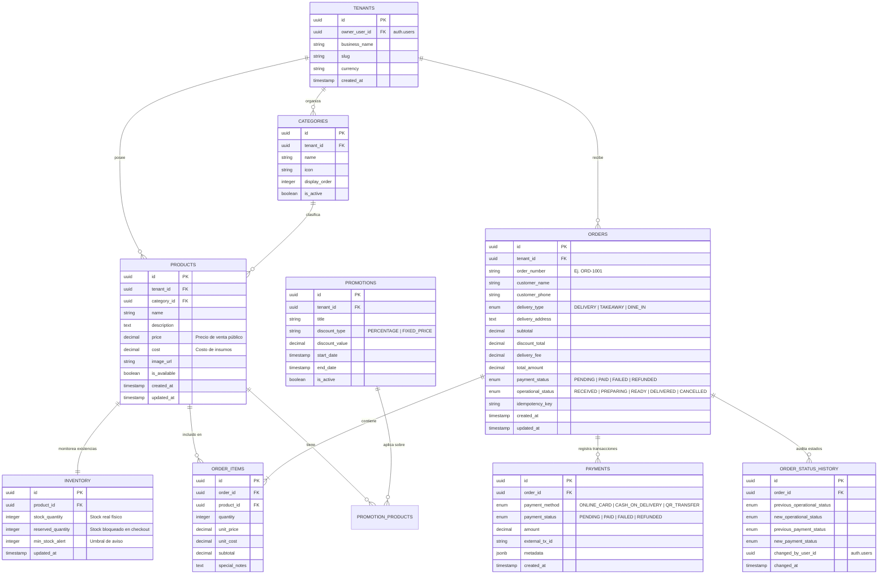

# 🗄️ Guía de Backend & Supabase: saasPedidos

Este documento contiene el **Modelo de Base de Datos relacional**, los **diagramas de arquitectura**, el **script DDL SQL completo optimizado para Supabase**, las políticas de **Seguridad a Nivel de Fila (RLS)**, la configuración de **Realtime** y las funciones almacenadas (RPC) para la reserva atómica de inventario.

---

## 1. 📊 Diagrama Entidad-Relación (Mermaid ERD)



---

## 2. ⚡ Script SQL Completo para Supabase (SQL Editor)

Copia y pega este script directamente en el **SQL Editor** de tu proyecto Supabase:

```sql
-- ============================================================================
-- 1. EXTENSIONES REQUERIDAS
-- ============================================================================
CREATE EXTENSION IF NOT EXISTS "uuid-ossp";
CREATE EXTENSION IF NOT EXISTS "pgcrypto";

-- ============================================================================
-- 2. ENUMS
-- ============================================================================
DO $$ BEGIN
    CREATE TYPE delivery_type_enum AS ENUM ('DELIVERY', 'TAKEAWAY', 'DINE_IN');
EXCEPTION
    WHEN duplicate_object THEN null;
END $$;

DO $$ BEGIN
    CREATE TYPE payment_status_enum AS ENUM ('PENDING', 'PAID', 'FAILED', 'REFUNDED');
EXCEPTION
    WHEN duplicate_object THEN null;
END $$;

DO $$ BEGIN
    CREATE TYPE operational_status_enum AS ENUM (
        'RECEIVED', 
        'PREPARING', 
        'READY_FOR_PICKUP_DELIVERY', 
        'DELIVERED', 
        'CANCELLED'
    );
EXCEPTION
    WHEN duplicate_object THEN null;
END $$;

DO $$ BEGIN
    CREATE TYPE payment_method_enum AS ENUM ('ONLINE_CARD', 'CASH_ON_DELIVERY', 'QR_TRANSFER');
EXCEPTION
    WHEN duplicate_object THEN null;
END $$;

-- ============================================================================
-- 3. TABLAS PRINCIPALES
-- ============================================================================

-- A. Restaurantes / Negocios (Multi-tenant)
CREATE TABLE IF NOT EXISTS tenants (
    id UUID PRIMARY KEY DEFAULT gen_random_uuid(),
    owner_user_id UUID REFERENCES auth.users(id) ON DELETE SET NULL,
    business_name VARCHAR(150) NOT NULL,
    slug VARCHAR(80) NOT NULL UNIQUE,
    currency VARCHAR(10) NOT NULL DEFAULT 'USD',
    is_active BOOLEAN NOT NULL DEFAULT true,
    created_at TIMESTAMP WITH TIME ZONE DEFAULT timezone('utc'::text, now()) NOT NULL
);

-- B. Categorías del Menú
CREATE TABLE IF NOT EXISTS categories (
    id UUID PRIMARY KEY DEFAULT gen_random_uuid(),
    tenant_id UUID NOT NULL REFERENCES tenants(id) ON DELETE CASCADE,
    name VARCHAR(100) NOT NULL,
    icon VARCHAR(50) DEFAULT 'Sparkles',
    display_order INTEGER DEFAULT 0,
    is_active BOOLEAN NOT NULL DEFAULT true,
    created_at TIMESTAMP WITH TIME ZONE DEFAULT timezone('utc'::text, now()) NOT NULL
);

-- C. Productos
CREATE TABLE IF NOT EXISTS products (
    id UUID PRIMARY KEY DEFAULT gen_random_uuid(),
    tenant_id UUID NOT NULL REFERENCES tenants(id) ON DELETE CASCADE,
    category_id UUID NOT NULL REFERENCES categories(id) ON DELETE RESTRICT,
    name VARCHAR(150) NOT NULL,
    description TEXT,
    price NUMERIC(10, 2) NOT NULL CHECK (price >= 0),
    cost NUMERIC(10, 2) NOT NULL DEFAULT 0.00 CHECK (cost >= 0),
    image_url VARCHAR(500),
    is_available BOOLEAN NOT NULL DEFAULT true,
    is_promo BOOLEAN NOT NULL DEFAULT false,
    promo_price NUMERIC(10, 2) CHECK (promo_price IS NULL OR promo_price >= 0),
    promo_label VARCHAR(60),
    created_at TIMESTAMP WITH TIME ZONE DEFAULT timezone('utc'::text, now()) NOT NULL,
    updated_at TIMESTAMP WITH TIME ZONE DEFAULT timezone('utc'::text, now()) NOT NULL
);

-- D. Inventario y Alertas de Stock Bajo
CREATE TABLE IF NOT EXISTS inventory (
    id UUID PRIMARY KEY DEFAULT gen_random_uuid(),
    product_id UUID UNIQUE NOT NULL REFERENCES products(id) ON DELETE CASCADE,
    stock_quantity INTEGER NOT NULL DEFAULT 0 CHECK (stock_quantity >= 0),
    reserved_quantity INTEGER NOT NULL DEFAULT 0 CHECK (reserved_quantity >= 0),
    min_stock_alert INTEGER NOT NULL DEFAULT 5,
    updated_at TIMESTAMP WITH TIME ZONE DEFAULT timezone('utc'::text, now()) NOT NULL
);

-- E. Promociones Programables
CREATE TABLE IF NOT EXISTS promotions (
    id UUID PRIMARY KEY DEFAULT gen_random_uuid(),
    tenant_id UUID NOT NULL REFERENCES tenants(id) ON DELETE CASCADE,
    title VARCHAR(150) NOT NULL,
    discount_type VARCHAR(30) NOT NULL CHECK (discount_type IN ('PERCENTAGE', 'FIXED_PRICE')),
    discount_value NUMERIC(10, 2) NOT NULL,
    start_date TIMESTAMP WITH TIME ZONE NOT NULL,
    end_date TIMESTAMP WITH TIME ZONE NOT NULL,
    is_active BOOLEAN NOT NULL DEFAULT true,
    created_at TIMESTAMP WITH TIME ZONE DEFAULT timezone('utc'::text, now()) NOT NULL
);

-- F. Pedidos / Órdenes
CREATE TABLE IF NOT EXISTS orders (
    id UUID PRIMARY KEY DEFAULT gen_random_uuid(),
    tenant_id UUID NOT NULL REFERENCES tenants(id) ON DELETE CASCADE,
    order_number VARCHAR(30) NOT NULL UNIQUE,
    customer_name VARCHAR(120) NOT NULL,
    customer_phone VARCHAR(40) NOT NULL,
    delivery_type delivery_type_enum NOT NULL DEFAULT 'DELIVERY',
    delivery_address TEXT,
    subtotal NUMERIC(10, 2) NOT NULL,
    discount_total NUMERIC(10, 2) NOT NULL DEFAULT 0.00,
    delivery_fee NUMERIC(10, 2) NOT NULL DEFAULT 0.00,
    total_amount NUMERIC(10, 2) NOT NULL,
    -- Estados Desacoplados:
    payment_status payment_status_enum NOT NULL DEFAULT 'PENDING',
    operational_status operational_status_enum NOT NULL DEFAULT 'RECEIVED',
    idempotency_key VARCHAR(120) UNIQUE,
    estimated_minutes INTEGER DEFAULT 30,
    created_at TIMESTAMP WITH TIME ZONE DEFAULT timezone('utc'::text, now()) NOT NULL,
    updated_at TIMESTAMP WITH TIME ZONE DEFAULT timezone('utc'::text, now()) NOT NULL
);

-- G. Ítems del Pedido (Composición)
CREATE TABLE IF NOT EXISTS order_items (
    id UUID PRIMARY KEY DEFAULT gen_random_uuid(),
    order_id UUID NOT NULL REFERENCES orders(id) ON DELETE CASCADE,
    product_id UUID NOT NULL REFERENCES products(id) ON DELETE RESTRICT,
    quantity INTEGER NOT NULL CHECK (quantity > 0),
    unit_price NUMERIC(10, 2) NOT NULL,
    unit_cost NUMERIC(10, 2) NOT NULL,
    subtotal NUMERIC(10, 2) NOT NULL,
    special_notes TEXT
);

-- H. Transacciones de Pago
CREATE TABLE IF NOT EXISTS payments (
    id UUID PRIMARY KEY DEFAULT gen_random_uuid(),
    order_id UUID NOT NULL REFERENCES orders(id) ON DELETE CASCADE,
    payment_method payment_method_enum NOT NULL,
    payment_status payment_status_enum NOT NULL DEFAULT 'PENDING',
    amount NUMERIC(10, 2) NOT NULL,
    external_tx_id VARCHAR(150),
    metadata JSONB DEFAULT '{}'::jsonb,
    created_at TIMESTAMP WITH TIME ZONE DEFAULT timezone('utc'::text, now()) NOT NULL
);

-- I. Historial de Auditoría de Estados (Timeline)
CREATE TABLE IF NOT EXISTS order_status_history (
    id UUID PRIMARY KEY DEFAULT gen_random_uuid(),
    order_id UUID NOT NULL REFERENCES orders(id) ON DELETE CASCADE,
    previous_operational_status operational_status_enum,
    new_operational_status operational_status_enum,
    previous_payment_status payment_status_enum,
    new_payment_status payment_status_enum,
    changed_by_user_id UUID REFERENCES auth.users(id) ON DELETE SET NULL,
    notes TEXT,
    changed_at TIMESTAMP WITH TIME ZONE DEFAULT timezone('utc'::text, now()) NOT NULL
);

-- ============================================================================
-- 4. VISTAS CALCULADAS
-- ============================================================================

-- Vista de Productos con Cálculo Dinámico de Margen y Estado de Stock
CREATE OR REPLACE VIEW v_catalog_insights AS
SELECT 
    p.id,
    p.tenant_id,
    p.category_id,
    c.name AS category_name,
    p.name,
    p.description,
    p.price,
    p.cost,
    (p.price - p.cost) AS net_profit_dollars,
    CASE 
        WHEN p.price > 0 THEN ROUND(((p.price - p.cost) / p.price) * 100, 2)
        ELSE 0
    END AS margin_percentage,
    i.stock_quantity,
    i.reserved_quantity,
    (i.stock_quantity - i.reserved_quantity) AS available_quantity,
    i.min_stock_alert,
    ((i.stock_quantity - i.reserved_quantity) <= i.min_stock_alert) AS is_low_stock,
    p.is_available,
    p.is_promo,
    p.promo_price,
    p.promo_label,
    p.image_url
FROM products p
JOIN categories c ON c.id = p.category_id
LEFT JOIN inventory i ON i.product_id = p.id;

-- ============================================================================
-- 5. PROCEDIMIENTOS ALMACENADOS (RPC) PARA CONCURRENCIA E INVENTARIO
-- ============================================================================

-- Función Atómica para Reservar Inventario en Checkout (Evita carreras concurrentes)
CREATE OR REPLACE FUNCTION reserve_inventory_for_order(
    p_product_id UUID,
    p_quantity INTEGER
)
RETURNS BOOLEAN
LANGUAGE plpgsql
SECURITY DEFINER
AS $$
DECLARE
    v_available INTEGER;
BEGIN
    -- Bloquea la fila del producto para lectura y actualización segura
    SELECT (stock_quantity - reserved_quantity)
    INTO v_available
    FROM inventory
    WHERE product_id = p_product_id
    FOR UPDATE;

    IF v_available IS NULL OR v_available < p_quantity THEN
        RETURN FALSE; -- Stock insuficiente
    END IF;

    -- Bloquea las unidades requeridas
    UPDATE inventory
    SET reserved_quantity = reserved_quantity + p_quantity,
        updated_at = timezone('utc'::text, now())
    WHERE product_id = p_product_id;

    RETURN TRUE;
END;
$$;

-- Función Atómica para Consolidar la Venta tras Pago Confirmado
CREATE OR REPLACE FUNCTION confirm_inventory_sale(
    p_product_id UUID,
    p_quantity INTEGER
)
RETURNS VOID
LANGUAGE plpgsql
SECURITY DEFINER
AS $$
BEGIN
    UPDATE inventory
    SET stock_quantity = stock_quantity - p_quantity,
        reserved_quantity = GREATEST(0, reserved_quantity - p_quantity),
        updated_at = timezone('utc'::text, now())
    WHERE product_id = p_product_id;
END;
$$;

-- Función Atómica para Liberar Reserva por Expiración o Cancelación
CREATE OR REPLACE FUNCTION release_inventory_reservation(
    p_product_id UUID,
    p_quantity INTEGER
)
RETURNS VOID
LANGUAGE plpgsql
SECURITY DEFINER
AS $$
BEGIN
    UPDATE inventory
    SET reserved_quantity = GREATEST(0, reserved_quantity - p_quantity),
        updated_at = timezone('utc'::text, now())
    WHERE product_id = p_product_id;
END;
$$;

-- ============================================================================
-- 6. DISPARADORES (TRIGGERS) PARA AUDITORÍA DE ESTADOS
-- ============================================================================

CREATE OR REPLACE FUNCTION log_order_status_changes()
RETURNS TRIGGER
LANGUAGE plpgsql
AS $$
BEGIN
    IF (OLD.operational_status IS DISTINCT FROM NEW.operational_status) OR 
       (OLD.payment_status IS DISTINCT FROM NEW.payment_status) THEN
        INSERT INTO order_status_history (
            order_id,
            previous_operational_status,
            new_operational_status,
            previous_payment_status,
            new_payment_status,
            changed_by_user_id,
            changed_at
        ) VALUES (
            NEW.id,
            OLD.operational_status,
            NEW.operational_status,
            OLD.payment_status,
            NEW.payment_status,
            auth.uid(),
            timezone('utc'::text, now())
        );
    END IF;
    RETURN NEW;
END;
$$;

DROP TRIGGER IF EXISTS trg_order_status_changes ON orders;
CREATE TRIGGER trg_order_status_changes
AFTER UPDATE ON orders
FOR EACH ROW
EXECUTE FUNCTION log_order_status_changes();

-- ============================================================================
-- 7. ACTIVAR SUPABASE REALTIME
-- ============================================================================
ALTER PUBLICATION supabase_realtime ADD TABLE orders;
ALTER PUBLICATION supabase_realtime ADD TABLE inventory;

-- ============================================================================
-- 8. POLÍTICAS ROW LEVEL SECURITY (RLS)
-- ============================================================================

ALTER TABLE products ENABLE ROW LEVEL SECURITY;
ALTER TABLE categories ENABLE ROW LEVEL SECURITY;
ALTER TABLE inventory ENABLE ROW LEVEL SECURITY;
ALTER TABLE orders ENABLE ROW LEVEL SECURITY;
ALTER TABLE order_items ENABLE ROW LEVEL SECURITY;
ALTER TABLE payments ENABLE ROW LEVEL SECURITY;
ALTER TABLE order_status_history ENABLE ROW LEVEL SECURITY;

-- Catálogo Público: Cualquiera (anon o auth) puede ver productos activos
CREATE POLICY "Public catalog is readable" 
ON products FOR SELECT 
TO anon, authenticated 
USING (is_available = true);

-- Categorías Públicas
CREATE POLICY "Public categories are readable" 
ON categories FOR SELECT 
TO anon, authenticated 
USING (is_active = true);

-- Inventario: Lectura pública de existencias
CREATE POLICY "Public inventory is readable" 
ON inventory FOR SELECT 
TO anon, authenticated 
USING (true);

-- Órdenes: Creación pública (cliente anónimo que hace checkout)
CREATE POLICY "Public can create orders" 
ON orders FOR INSERT 
TO anon, authenticated 
WITH CHECK (true);

-- Órdenes: Consulta pública por order_number (seguimiento)
CREATE POLICY "Public can track order by order_number" 
ON orders FOR SELECT 
TO anon, authenticated 
USING (true);

-- Ítems de Orden: Creación pública
CREATE POLICY "Public can create order items" 
ON order_items FOR INSERT 
TO anon, authenticated 
WITH CHECK (true);

-- Ítems de Orden: Lectura
CREATE POLICY "Public can read order items" 
ON order_items FOR SELECT 
TO anon, authenticated 
USING (true);

-- Admin / Cocina: Control total para usuarios autenticados del restaurante
CREATE POLICY "Staff full control on orders" 
ON orders FOR ALL 
TO authenticated 
USING (true) 
WITH CHECK (true);

CREATE POLICY "Staff full control on products" 
ON products FOR ALL 
TO authenticated 
USING (true) 
WITH CHECK (true);
```

---

## 3. 🔌 Conexión desde el Frontend (React + Supabase SDK)

### A. Variables de Entorno (`.env`)

Crea un archivo `.env` en la raíz del proyecto React:

```env
VITE_SUPABASE_URL=https://tu-proyecto.supabase.co
VITE_SUPABASE_ANON_KEY=tu-anon-key-publica
```

### B. Inicialización del Cliente (`src/lib/supabase.js`)

```javascript
import { createClient } from '@supabase/supabase-js';

const supabaseUrl = import.meta.env.VITE_SUPABASE_URL;
const supabaseAnonKey = import.meta.env.VITE_SUPABASE_ANON_KEY;

export const supabase = createClient(supabaseUrl, supabaseAnonKey);
```

### C. Suscripción en Tiempo Real para la Cocina (Kanban)

```javascript
import { useEffect, useState } from 'react';
import { supabase } from '../lib/supabase';

export function useRealtimeOrders() {
  const [orders, setOrders] = useState([]);

  useEffect(() => {
    // 1. Cargar órdenes iniciales
    const fetchOrders = async () => {
      const { data } = await supabase
        .from('orders')
        .select('*, order_items(*)')
        .order('created_at', { ascending: false });
      if (data) setOrders(data);
    };

    fetchOrders();

    // 2. Suscribirse a cambios en tiempo real (INSERT / UPDATE)
    const channel = supabase
      .channel('orders-kitchen-feed')
      .on(
        'postgres_changes',
        { event: '*', schema: 'public', table: 'orders' },
        (payload) => {
          if (payload.eventType === 'INSERT') {
            // Nuevo pedido entrante
            setOrders((prev) => [payload.new, ...prev]);
            // Opcional: sonido de campana de comanda
          } else if (payload.eventType === 'UPDATE') {
            // Cambio de estado operativo o financiero
            setOrders((prev) =>
              prev.map((o) => (o.id === payload.new.id ? { ...o, ...payload.new } : o))
            );
          }
        }
      )
      .subscribe();

    return () => {
      supabase.removeChannel(channel);
    };
  }, []);

  return orders;
}
```

### D. Suscripción en Tiempo Real para el Seguimiento del Cliente

```javascript
import { useEffect, useState } from 'react';
import { supabase } from '../lib/supabase';

export function useTrackOrder(orderNumber) {
  const [order, setOrder] = useState(null);

  useEffect(() => {
    if (!orderNumber) return;

    // Obtener orden actual
    supabase
      .from('orders')
      .select('*, order_items(*)')
      .eq('order_number', orderNumber)
      .single()
      .then(({ data }) => setOrder(data));

    // Escuchar solo este pedido específico
    const channel = supabase
      .channel(`tracking-${orderNumber}`)
      .on(
        'postgres_changes',
        {
          event: 'UPDATE',
          schema: 'public',
          table: 'orders',
          filter: `order_number=eq.${orderNumber}`,
        },
        (payload) => {
          setOrder((prev) => ({ ...prev, ...payload.new }));
        }
      )
      .subscribe();

    return () => {
      supabase.removeChannel(channel);
    };
  }, [orderNumber]);

  return order;
}
```

---

## 4. 📦 Pasos para Conectar Supabase al Proyecto

1. Crea un proyecto nuevo en [https://supabase.com](https://supabase.com).
2. Abre la pestaña **SQL Editor** en el panel de Supabase.
3. Copia el bloque SQL de la **Sección 2** de este documento y presiona **Run**.
4. Ve a **Project Settings -> API** y copia tu `URL` y tu `anon public key`.
5. Agrégalas a tu `.env` local.
6. Instala el cliente de Supabase en el frontend:
   ```bash
   npm install @supabase/supabase-js
   ```
7. Conecta el `RestaurantContext.jsx` a `supabase` utilizando las suscripciones en tiempo real descritas en la **Sección 3**.
